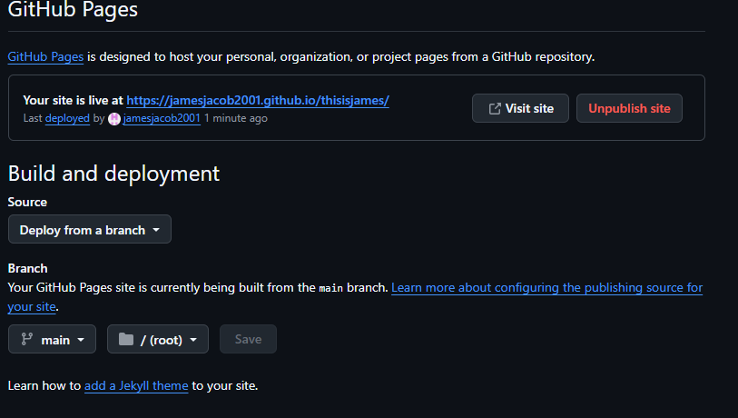
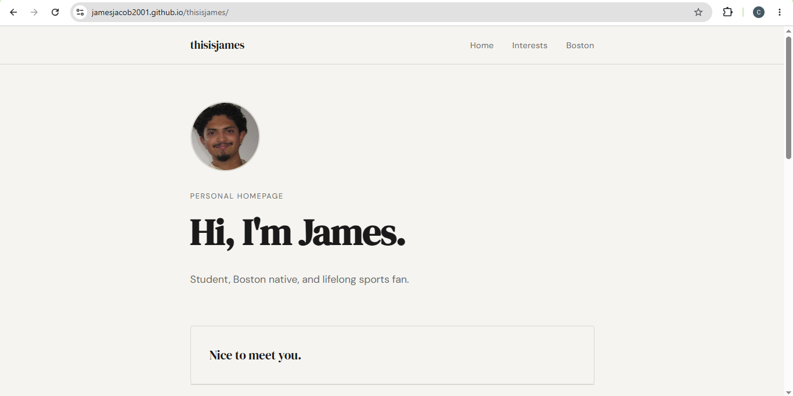

# thisisjames

**Author:** James  
**Course:** Web Design  
**License:** MIT

---

## Project Objective

A personal homepage built with vanilla HTML5, CSS3, and ES6+ JavaScript modules. The site introduces James — his background, interests, and the city he loves — across three static pages.

---

## Pages

| Page | URL | Description |
|---|---|---|
| Home | `index.html` | Landing page with bio snapshot and typewriter effect |
| Interests | `pages/interests.html` | Boston sports, F1, music & DJing |
| Boston | `pages/boston.html` | AI-generated history of Boston, MA |

---

## Screenshot





---

## Project Structure

```
thisisjames/
├── index.html            # Homepage
├── pages/
│   ├── interests.html    # Interests page
│   └── boston.html       # AI-generated Boston history page
├── css/
│   └── style.css         # Global stylesheet
├── js/
│   ├── main.js           # ES6 module entry point
│   ├── nav.js            # Active nav highlighting module
│   └── typewriter.js     # Typewriter creative component module
├── images/
│   └── favicon.ico       # Site favicon (add your own)
├── package.json
├── README.md
└── LICENSE
```

---

## Instructions to Build & Run

### Prerequisites
- [Node.js](https://nodejs.org/) (v18 or newer)

### Steps

```bash
# 1. Clone or download the project
git clone https://github.com/yourhandle/thisisjames.git
cd thisisjames

# 2. Install dev dependencies
npm install

# 3. Serve the site locally
npm start
# Opens at http://localhost:3000
```

> **Note:** Because the site uses ES6 modules (`type="module"`), you must serve it via a local server — opening `index.html` directly as a `file://` URL will not work.

---

## Linting & Formatting

```bash
# Run ESLint
npm run lint

# Format with Prettier
npm run format
```

---

## Use of GenAI

This project used Claude (Anthropic, claude-sonnet-4-20250514) to assist with:

- **Scaffolding:** Generating the initial HTML structure, CSS variables, and JS module boilerplate.
- **AI Page Content:** The text on `pages/boston.html` was generated by Claude based on the prompt: *"Write a brief history of Boston, Massachusetts, organized by era with headings and short paragraphs."*
- **Code review assistance:** Checking rubric alignment and accessibility attributes.

All generated content was reviewed and edited by the author before submission.

---

## License

MIT — see [LICENSE](./LICENSE) for details.
